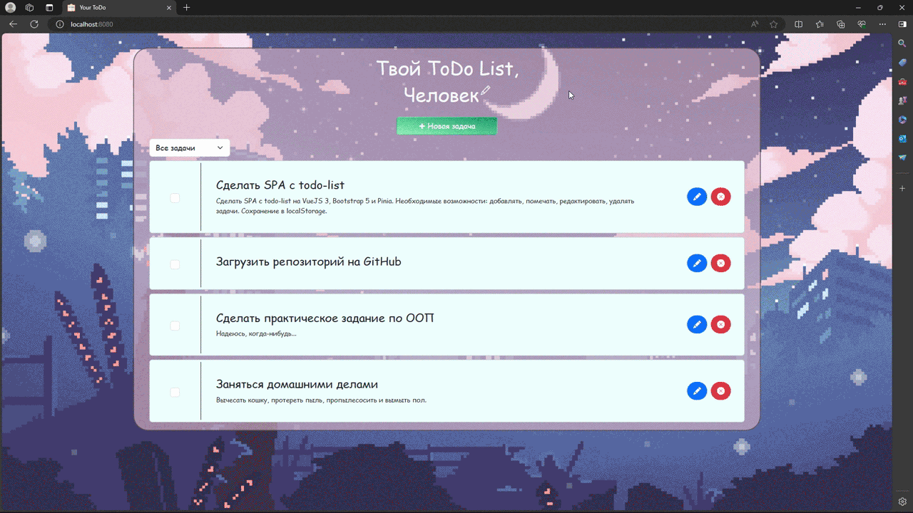
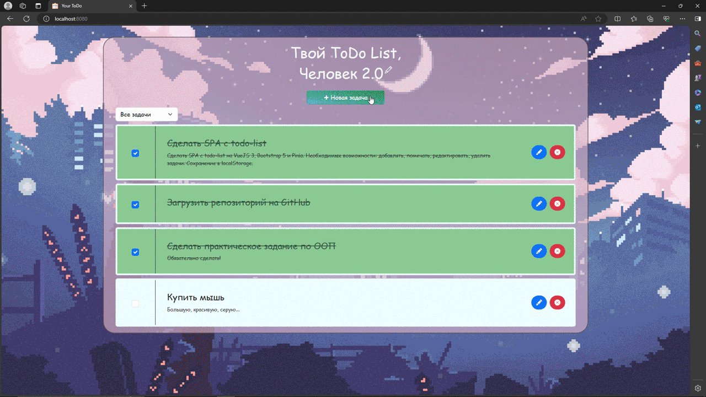
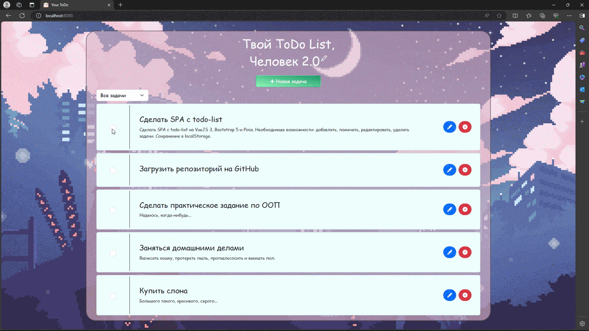
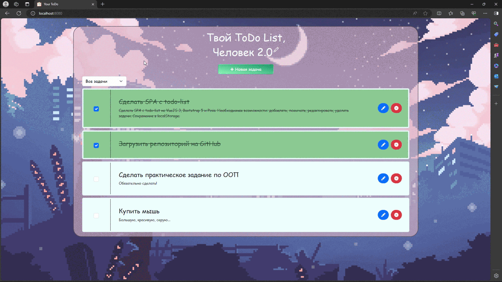

# my-todo
Это небольшое SPA с todo-list написано с помощью технологий VueJS 3, Bootstrap 5 и Pinia. Также используются HTML, CSS и JS. Полностью адаптивно и устойчиво к переполнению.

## Превью


---
*Добавление нового имени пользователя и новой задачи*:



---
*Если не было введено имя задачи*:



---
*Отметка, редактирование и удаление задач*:



---
*Фильтрация задач*:



## Требования
Необходимо установить Node.js и npm.

## Установка проекта
```
npm install
```

### Компиляция и запуск
```
npm run serve
```

## Как использовать
* Вы можете ввести любое имя пользователя, нажав на иконку каранадаша в самом верху. По завершению ввода необходимо нажать Enter.
* При нажатии на кнопку "Новая задача" можно ввести название и описание задачи. Чтобы она добавилась в список, требуется ввести хотя бы название, иначе при попытке сохранения появится предупреждающее окно, созданное с помощью vue-sweetalert2.
* Каждую задачу можно пометить как сделанную, полностью отредактировать её содержание или удалить.
* Задачи можно отфильтровать с помощью выпадающего меню по принципам "Все задачи", "В процессе" и "Завершённые". 
